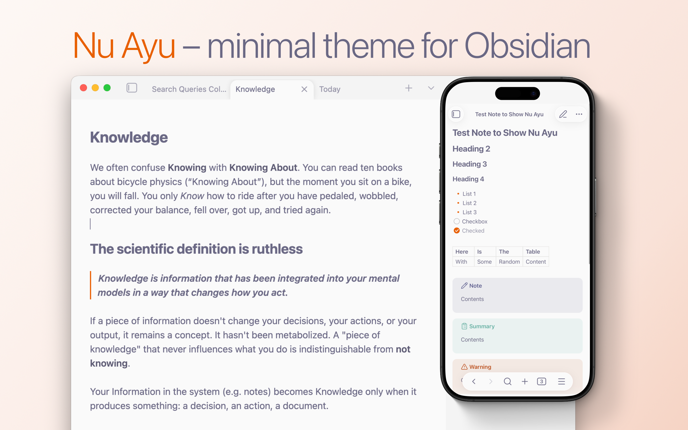

# Nu Ayu Theme for Obsidian
Latest version: **1.7.6** — now with full Notebook Navigator styling

Updated: **2026-08-28**

A minimal theme built around restraint. Soft, rounded surfaces, transparent dividers, and a deliberately muted text palette keep the interface quiet so your notes stay loud. Removed unnecessary hover effects, highlights, and other things that distract you from what's important – your thinking process.

Light mode draws from the Ayu color tradition: warm off-whites and purple-grey text that reduce eye strain without feeling washed out. 
Dark mode is an original: deep violet-tinged backgrounds with a consistent warm orange accent throughout.

The approach was "future-proof changes" — change only where it matters for removing distractions, improving focus, and smoothing experience – all while keeping longevity in mind. This keeps the theme stable across Obsidian updates and avoids the visual debt.

## Features 
- Light & Dark modes
- Super clean minimal look
- Removed most of the borders, hover effects, highlights on hover, unexpected box-shadows, and other stuff that contributes to distraction
- Very nice looking Dark Mode crafted from scratch with optional full black backgrounds option for mobile devices
- Special attention to mobile devices – bigger tap areas, file tree, reduced animations, and more
- Full size sidebars on phones
- Custom colors for Callouts
- Custom colors for Code Blocks
- Some love for Bases Cards appearance
- Dataview embeds and task lists now look much more "native" thanks to removing "foreign" animations and box-shadows effects
- Smooth fade-ins for the embedded content 
- Smooth appearance for the Markdown syntax
- Full Notebook Navigator styling to match overall aesthetics
- Style Settings support:
  - **Tab Close button on the left** – native feel for macOS and iPadOS 
  - **Thin Headers** for cleaner look
  - **Accent Folders** adds orange accent for visual hierarchy
  - **Removing Labels** on Bases Cards
  - **Clean links** – removing accents for notes heavy on internal links
  - **Full black backgrounds** option for mobile devices

As a result you have much more fluid, cohesive, and less overwhelming experience, with less distractions and more space for meaningful work.

## Manual Installation
Note: for now this theme is still under review to get to the official catalog. Once it is there – you'll be able to find it through standard Obsidian theme repo.

1. Download the `theme.css` and `manifest.json` files from the this GitHub page, or Download the [latest release](https://github.com/MrParalloid/nu-ayu/releases) archive.
2. Open your Obsidian vault on your computer.
3. Navigate to the hidden `.obsidian/themes/` folder. 
*Tip: If you don't see the `.obsidian` folder, enable "Show hidden files" in your OS settings.*
4. Create a new folder inside `themes` and name it **Nu Ayu**.
5. Move the downloaded `theme.css` and `manifest.json` files into this new folder.
6. Open Obsidian, go to **Settings** > **Appearance**, and select **Nu Ayu** from the Themes dropdown.

## Screenshots

